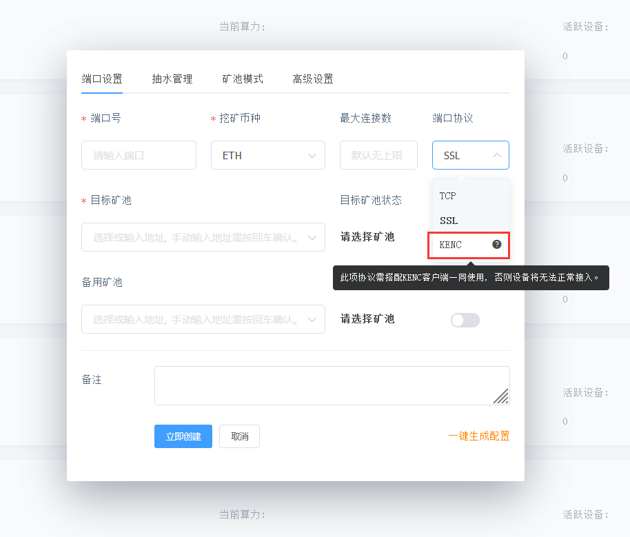
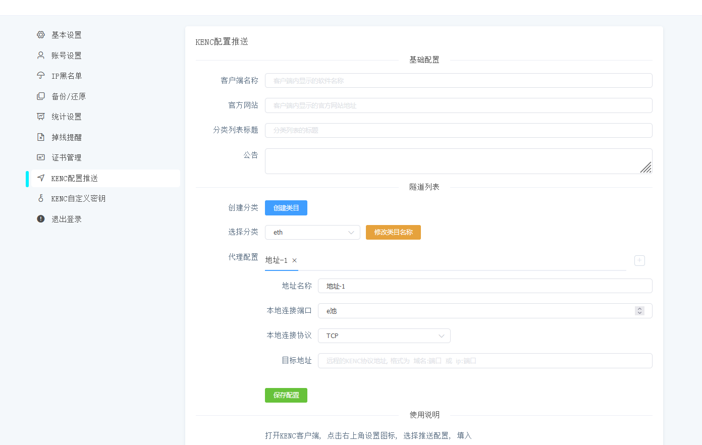

<div align="center">

# KENC文档说明

</div>

<p id="kenc"></p>

### KENC是本地->远程隧道，局域网部署在一台设备上即可，可与远程GoMinerTool通过KENC协议进行通信。
#### 8月9号之前下载的KENC如遇到断电掉配置问题，请重新下载即可！

<a href="https://github.com/MinerProxyBTC/GoMinerTool/raw/main/KENC/windows.zip">点击下载WINDOWS客户端</a>

<a href="https://github.com/MinerProxyBTC/GoMinerTool/raw/main/KENC/kenc_v_linux">点击下载LINUX客户端</a>

### 使用环境
```
GoMinerTool版本>=2.6.0
```

## 使用说明

### 1.远程GoMinerTool先配置一个KENC协议的端口



### 2.在Go的设置页面找到KENC配置推送, 如下图


### 3. KENC客户端首次打开, 或点击右上角设置, 即可更改配置推送地址, 配置设置完毕后重启KENC客户端即可拉取最新配置
